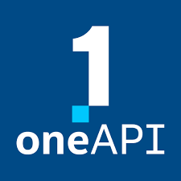

 

  

  <h3 align="center">Digitizing Handwritten Medical Prescriptions</h3>

  

    Welcome to our project!
     
    <a href="https://github.com/SDeBAS/MediScan.git"><strong>Explore the documentation</strong></a>
     
    <a href="https://drive.google.com/file/d/1oQ5JY3u107fGGAheen73WK0tgxWfVmIe/view?usp=sharing">View Demo</a>
  

 <!-- TABLE OF CONTENTS -->

  
Table of Contents

  <ol>
    <li>
      <a href="#about-the-project">Project Overview</a>
      <a href="#about-the-team">About the Team</a>
      <ul>
        <li><a href="#inspiration">Motivation Behind the Project</a></li>
        <li><a href=#social-impact>Outcome of the Project</a></li>
        <li><a href="#built-with">Built With</a></li>
      </ul>
    </li>
    <li>
      <a href="#intel-oneapi">Intel OneAPI</a>
      <ul>
        <li><a href="#use-of-onednn-in-our-project">Use of oneDAL and TensorFlow in our project</a></li>
      </ul>
    </li>
    <li><a href="#what-it-does">How we built it</a></li>
    <li><a href="#what-we-learned">What we learned</a></li>
  </ol>

 <!-- ABOUT THE PROJECT -->
## 📚 Project Overview

  

The "MediScan" project aims to transform healthcare by accurately converting handwritten prescriptions into digital formats. Leveraging advanced OCR and Artificial Intelligence (AI), enhances patient safety by reducing errors caused by manual interpretation. Developed collaboratively on GitHub, MediScan bridges traditional prescriptions with modern digital healthcare, ensuring efficient, secure, and precise medication management. 

(<a href="#readme-top">back to top</a>)

  <!-- ABOUT THE TEAM -->
## About The TEAM

  
  <h2>Health Heroes</h2>

This is  Team Health Heros, and we are pleased to introduce our project on Medical Prescription Handwritten Text Recognition utilizing cutting-edge technologies such as Artificial Intelligence (AI), Machine Learning (ML), and Deep Learning (DL), on Intel one API server using Intel oneDAL and Intel extension for Tensorflow.👨‍💻. 

(<a href="#readme-top">back to top</a>)

<!-- Motivation -->
## ⚡ Motivation Behind Our Project
The motivation behind the project stems from the critical need to address the potential risks associated with :
1. Critical Need: The project is motivated by the necessity to mitigate risks linked to interpreting handwritten prescriptions in healthcare.
2. Error Prone: Handwritten prescriptions often result in misinterpretations, causing medication errors, adverse reactions, and patient harm.
3. Advanced Technology: Leveraging OCR and machine learning, the project seeks to convert handwritten prescriptions into accurate digital formats.
4. Reliable Solution: The project's goal is to provide a dependable method to transform prescriptions, enhancing precision and reducing errors.
5. Streamlined Verification: Medical professionals benefit from streamlined prescription verification, improving patient safety.
6. Reduced Likelihood of Errors: Through cutting-edge techniques, the project significantly diminishes the chance of errors with severe health consequences.

## ⚡ Outcome of our Project
1. Seamlessly bridge traditional handwritten prescriptions and modern digital healthcare systems.
2. Address concerns about potential errors in interpreting handwritten prescriptions due to medical complexity.
3. Utilize advanced optical character recognition (OCR) technology and machine learning to transcribe prescriptions accurately.
4. Transform handwritten prescriptions into a digital, machine-readable format.
5. Enable medical professionals to effortlessly access, verify, and process prescription information.
6. Minimize risks of medication errors, drug interactions, and dosage inaccuracies.

## ⚡ Social Impact of Our Project
The "MediScan" project holds several significant social impacts:

1. Enhanced Patient Safety: Reduces the potential for medication errors caused by misinterpretation of handwritten prescriptions, leading to improved patient well-being.

2. Accurate Treatment: Ensures that patients receive the correct medications, dosages, and instructions, enhancing the effectiveness of medical treatments.

3. Time Efficiency: Medical professionals can quickly access and verify prescription information, enabling them to allocate more time to patient care rather than deciphering handwriting.

4. Reduced Healthcare Costs: Minimizes the financial burden caused by medication errors, hospital readmissions, and adverse drug reactions.

5. Global Accessibility: Increases access to accurate prescription processing in remote or underserved areas, contributing to equitable healthcare distribution.

6. Improved Medical Record Keeping: Contributes to more accurate electronic health records, facilitating better treatment tracking and history for patients.

7. Professional Collaboration: Promotes smoother communication between healthcare providers, pharmacists, and patients, fostering a collaborative healthcare ecosystem.

8. Technology Adoption: Encourages the integration of modern technology in healthcare practices, setting a precedent for innovation in medical processes.

9. Medical Advancements: Generates data that could be used for medical research, enabling insights into prescribing trends, patient adherence, and treatment outcomes.

10. Patient Empowerment: Empowers patients with clear and legible prescriptions, enabling them to understand and follow their treatment plans accurately.

### Built With 

This section should list any major frameworks/libraries used to bootstrap your project. Here are a few examples.

* [![oneapi][oneapi]][oneapi-url]
  * [![onedal][onedal]][onedal-url]
* [![python][python]][python-url]
* [![jupyter][jupyter]][jupyter-url]
* [![tensorflow][tensorflow]][tensorflow-url]
* [![oneAPI AI Analytical Toolkit][aitoolkit]][aitoolkit-url]
  

<!-- Intel one api -->
## Intel oneAPI 
Intel OneAPI is a comprehensive development platform for building high-performance, cross-architecture applications. It provides a unified programming model, tools, and libraries that allow developers to optimize their applications for Intel CPUs, GPUs, FPGAs, and other hardware. Intel OneAPI includes support for popular programming languages like C++, Python, and Fortran, as well as frameworks for deep learning, high-performance computing, and data analytics. With Intel OneAPI, developers can build applications that can run on a variety of hardware platforms, from edge devices to data centers, and take advantage of the performance benefits of Intel architectures.

### Use of oneDAL and TensorFlow in our project

In our project, we harness the capabilities of both oneDAL (oneAPI Data Analytics Library) and the oneAPI AI Analytics Toolkit, which includes TensorFlow, to enhance the accuracy and efficiency of converting handwritten prescriptions into a digital format. Here's how we utilize these tools:

oneDAL (oneAPI Data Analytics Library):
* Data Preprocessing: We use oneDAL to efficiently preprocess the input handwritten prescription images. This includes tasks like resizing images, normalization, and noise reduction, all of which are critical for improving the quality of input data before feeding it into our machine-learning models.

* Feature Engineering: oneDAL provides optimized algorithms for feature engineering, which we use to extract relevant features from the prescription images. This process aids our machine learning models in understanding and differentiating various characters and symbols within the prescriptions.

* oneAPI AI Analytics Toolkit (TensorFlow):

TensorFlow serves as a cornerstone of our project, providing a robust and versatile framework for building and training our machine learning models. We employ TensorFlow's high-level APIs to construct and fine-tune our OCR and transcription models, allowing us to handle various data preprocessing steps, model architectures, and training strategies. TensorFlow's extensive ecosystem also aids in experimentation, visualization, and model deployment, enabling us to iterate and improve our prescription digitization system effectively.

* Model Development: TensorFlow, included in the oneAPI AI Analytics Toolkit, forms the backbone of our machine learning model development. We utilize TensorFlow's high-level APIs to design, train, and fine-tune neural networks for optical character recognition (OCR) and transcription tasks.

* Model Optimization: TensorFlow's integration with oneDNN (oneAPI Deep Neural Network Library) enables us to optimize the performance of our neural network computations. We leverage oneDNN's deep learning primitives and optimization capabilities to accelerate the execution of complex neural network operations, resulting in faster inference times and improved overall performance.

* Training and Evaluation: We use TensorFlow to train our models on annotated data, iteratively improving their accuracy and performance through backpropagation and gradient-based optimization techniques. TensorFlow also provides tools for evaluating our models' accuracy, enabling us to fine-tune their architectures for optimal results.

By combining the power of one and the oneAPI AI Analytics Toolkit (including TensorFlow), we ensure that our project benefits from optimized data preprocessing, feature engineering, and machine learning model development. This approach contributes to the accurate and efficient conversion of handwritten prescriptions into a digital format, ultimately enhancing patient safety and streamlining healthcare processes.

## How we built it 
These are the steps involved in making this project: 
* Importing Libraries
* Data Importing
* Data Exploration
* Data Configuration
* Preparing the Data
  * Creating a Generator for Training Set
  * Creating a Generator for Testing Set
* Writing the labels into a text file 'Labels.txt'
* Model Creation
* Model Compilation
* Training the Model 
* Testing Predictions
* Saving model as 'model.pkl'
* Deploying the Model as a Web Application

(<a href="#readme-top">back to top</a>)

## What we learned
Throughout the course of the project, we gained valuable insights and knowledge that have not only advanced our technical skills but also enriched our understanding of healthcare, technology, and collaboration. Here's what we learned:

1. Healthcare Domain Expertise: We deepened our understanding of the challenges and complexities within the healthcare sector, particularly the significance of accurate medication management and patient safety.

2. Optical Character Recognition (OCR) Techniques: We became proficient in various OCR techniques, learning how to preprocess and extract textual information from handwritten prescriptions effectively.

3. Machine Learning and Deep Learning: Our project honed our skills in building and training machine learning models, especially neural networks, to accurately transcribe handwritten text into digital formats.

4. Data Preprocessing: We learned the critical role of data preprocessing in enhancing model performance, including techniques such as normalization, noise reduction, and image augmentation.

5. Model Optimization: We explored strategies for optimizing model performance and efficiency, including leveraging libraries like oneDNN to accelerate neural network computations.

6. GitHub Collaboration: Our project's collaborative nature taught us how to effectively collaborate with team members, manage version control, address issues, and merge contributions using GitHub.

7. Open-Source Contributions: Through community-driven contributions and discussions, we gained experience in open-source development, understanding how a collaborative environment fosters innovation.

8. **Patient-Centric Design:** We grasped the importance of designing technology solutions with patients' safety and well-being at the forefront, aligning technology goals with healthcare objectives.

9. Communication and Documentation: Our project emphasized clear communication and thorough documentation, showcasing the significance of conveying ideas, progress, and instructions effectively.

10. Interdisciplinary Learning: We recognized the value of interdisciplinary collaboration, where expertise in healthcare, technology, and various domains converges to create impactful solutions.

11. Ethical Considerations: We delved into the ethical implications of our project, considering issues like data privacy, consent, and the responsible use of technology in healthcare.

12. Continuous Improvement: Iterative development taught us the value of continuous improvement, actively incorporating feedback and refining our approach to create a more effective solution.

In summary, our project has been a profound learning experience that enriched our technical, collaborative, and ethical understanding, equipping us with skills that transcend the boundaries of healthcare and technology and empowering us to make a positive impact on patient care and safety.

[python]: https://img.shields.io/badge/Python-3470a3?&logoColor=white
[python-url]: https://www.python.org/
[jupyter]: https://img.shields.io/badge/Jupyter%20Notebook-da5b0b?&logoColor=white
[jupyter-url]: https://jupyter.org/
[tensorflow]: https://img.shields.io/badge/TensorFlow-f0b93a?&logoColor=white
[tensorflow-url]: https://www.tensorflow.org/
[oneapi]: https://img.shields.io/badge/Intel%20oneAPI-20232A?&logoColor=61DAFB
[oneapi-url]: https://www.intel.com/content/www/us/en/docs/oneapi/programming-guide/2023-0/intel-oneapi-data-analytics-library-onedal.html
[onedal]: https://img.shields.io/badge/oneDNN-20232A?&logoColor=61DAFB](https://github.com/oneapi-src/oneDAL)
[onedal-url]:https://www.intel.com/content/www/us/en/docs/oneapi/programming-guide/2023-1/intel-oneapi-data-analytics-library-onedal.html)https://www.intel.com/content/www/us/en/docs/oneapi/programming-guide/2023-1/intel-oneapi-data-analytics-library-onedal.html
[aitoolkit]:https://pub.towardsai.net/introduction-to-intels-oneapi-ai-analytics-toolkit-8dd873925b96
[aitoolkit-url]: https://www.intel.com/content/www/us/en/developer/tools/oneapi/ai-analytics-toolkit.html#gs.4aqjyn
